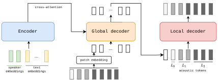

# MARS6: A Small & Robust Hierarchical-Codec Text-to-Speech Model

**MARS6** is a compact autoregressive TTS system based on a hierarchical neural audio codec. It uses a two-stage decoder to predict coarse-to-fine tokens at only **12 Hz**, leading to fast inference while preserving high audio quality and speaker similarity. MARS6 achieves robust zero-shot voice cloning and expressive synthesis even on challenging in-the-wild references. This repository provides a lightweight implementation for inference using our public turbo checkpoints.

[](https://colab.research.google.com/github/Camb-ai/mars6-turbo/blob/master/MARS6_turbo_inference_demo.ipynb)

---

## Model Architecture

Below is a high-level diagram of MARS6 from our paper. The encoder processes the text and speaker embeddings (from an external speaker encoder), producing a sequence of latent features. The hierarchical decoder operates at a low 12 Hz "global" level while autoregressively expanding each frame into multiple discrete codec tokens with a small "local" decoder.

<p align="center">
  
</p>

---

## Links

- **Project Page**: [MARS6-Turbo Demo & Samples](https://camb-ai.github.io/mars6-turbo/)
- **arXiv Paper**: [MARS6: A Small and Robust Hierarchical-Codec Text-to-Speech Model](https://arxiv.org/abs/2501.05787)
- **Website**: [https://camb.ai](https://camb.ai)

---

## Quick Start Guide

This section outlines how to install and run MARS6 for inference. You can either clone this repository and install dependencies or load MARS6 directly via Torch Hub.

### Installation

You can install MARS6 in two ways:

#### Option 1: Direct Installation from GitHub

```bash
uv pip install git+https://github.com/Camb-ai/mars6-turbo.git
```
or using pip:
```bash
pip install git+https://github.com/Camb-ai/mars6-turbo.git
```

#### Option 2: Local Development Installation

1. **Clone this repo**:
   ```bash
   git clone https://github.com/Camb-ai/mars6-turbo.git
   cd mars6
   ```

2. **Install in editable mode**:
   ```bash
   pip install -e .
   ```

Both methods will automatically install all required dependencies. The package requires Python 3.8+.

### Usage

After installation, you can use MARS6 in two ways:

#### Command Line Interface

```bash
# Basic usage (using an audio file as reference)
mars6 --audio path/to/reference.wav --text "Hello, this is a test of the Mars6 TTS end to end voice cloning system." --save_path output.wav

# Example using the included sample audio
# First, download example.wav from the repository's assets folder
mars6 --audio example.wav --text "Hello, this is a test of the Mars6 TTS end to end voice cloning system." --save_path output.wav

# Advanced usage with deep cloning
mars6 \
    --audio assets/example.wav \
    --text "Hello, this is a test of the Mars6 TTS end to end voice cloning system." \
    --save_path output.wav \
    --device cuda \
    --deep_clone_mode per-chunk \
    --transcript "Optional: provide the transcript of the reference audio for better cloning"
```

The CLI tool will use CUDA if available, otherwise fall back to CPU.

#### Python Package

```python
from mars6 import inference

# See example.py for complete usage example
```

For interactive usage, you can also use the [`MARS6_turbo_inference_demo.ipynb`](MARS6_turbo_inference_demo.ipynb) notebook.

---

## Acknowledgements

- We use [**minBPE** by Karpathy](https://github.com/karpathy/minbpe) for byte-pair tokenization utilities.
- We were inspired by ideas from [**MEGABYTE**](https://arxiv.org/abs/2302.10866) for multi-scale token processing.
- We leverage [**SNAC**](https://github.com/hubertsiuzdak/snac) for the discrete audio codec.
- [**WAVLM**](https://huggingface.co/microsoft/wavlm-base-plus-sv) and [**CLAP**](https://github.com/microsoft/CLAP) are utilised for speaker information embedding.
- Additional TTS references and techniques from VALL-E, StyleTTS2, XTTSv2, and more (see paper).

Thank you to the authors of these amazing works above for making this model possible!

---

## Contributions

We welcome any contributions to improving the model.
We'd also love to see how you used MARS6-Turbo in different scenarios, please use the [🙌 Show and tell](https://github.com/Camb-ai/MARS6-Turbo/discussions/categories/show-and-tell) category in Discussions to share your examples.

**Contribution format**:

The preferred way to contribute to our repo is to fork the [master repository](https://github.com/Camb-ai/mars6-turbo) on GitHub:

1. Fork the repo on GitHub
2. Clone the repo, set upstream as this repo: `git remote add upstream git@github.com:Camb-ai/mars6-turbo.git`
3. Make a new local branch and make your changes, commit changes.
4. Push changes to new upstream branch: `git push --set-upstream origin <NAME-NEW-BRANCH>`
5. On GitHub, go to your fork and click 'Pull Request' to begin the PR process. Please make sure to include a description of what you did/fixed.

## Join Our Team

We're an ambitious team, globally distributed, with a singular aim of making everyone's voice count. At CAMB.AI, we're a research team of Interspeech-published, Carnegie Mellon, ex-Siri engineers and we're looking for you to join our team.

We're actively hiring; please drop us an email at <ack@camb.ai> if you're interested. Visit our [careers page](https://www.camb.ai/careers) for more info.

## Community

Join CAMB.AI community on [Forum](https://github.com/Camb-ai/MARS6-Turbo/discussions) and
[Discord](https://discord.gg/FFQNCSKSXX) to share any suggestions, feedback, or questions with our team.

## Support Camb.ai on Ko-fi ❤️

[](https://ko-fi.com/cambai)

## Citation

If you use this repository or MARS6 in your research, please cite our [paper](https://arxiv.org/abs/2501.05787) with the following:

```bibtex
@inproceedings{mars6-2025icassp,
  author    = {Baas, Matthew and Scholtz, Pieter and Mehta, Arnav and Dyson, Elliott and Prakash, Akshat and Kamper, Herman},
  title     = {{MARS6}: A Small and Robust Hierarchical-Codec Text-to-Speech Model},
  booktitle = {IEEE ICASSP},
  year      = {2025},
  doi       = {10.1234/icassp.2025.mars6}
}
```

**Thank you for trying MARS6!** For issues, please open a GitHub ticket
